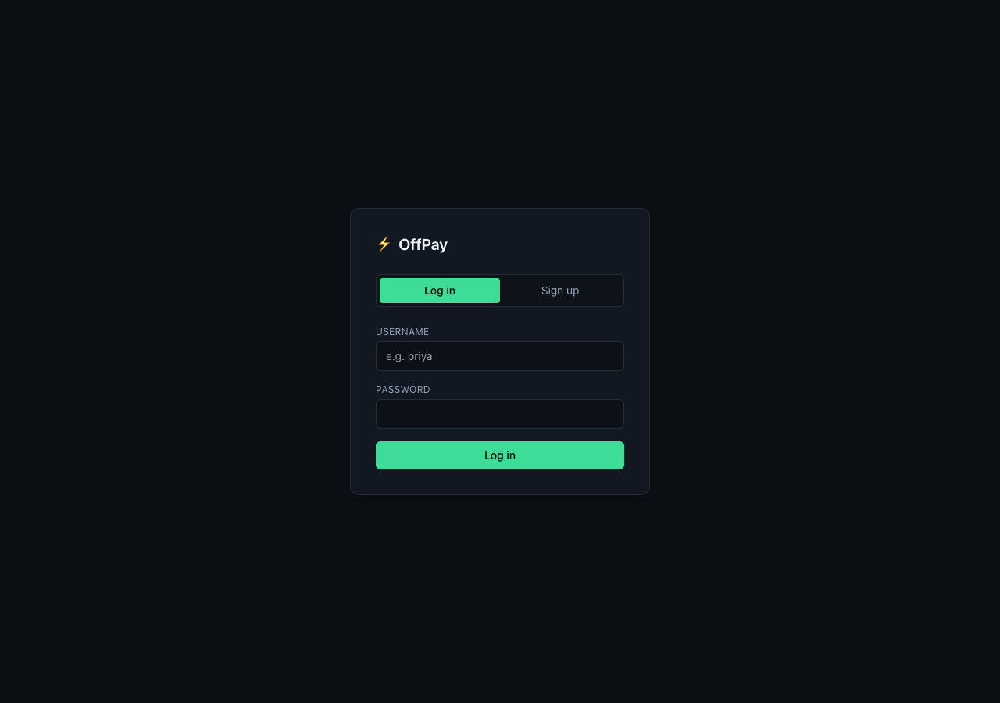
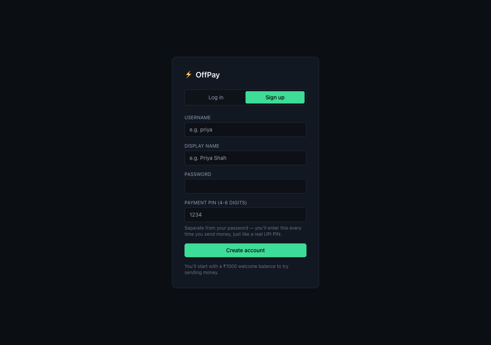
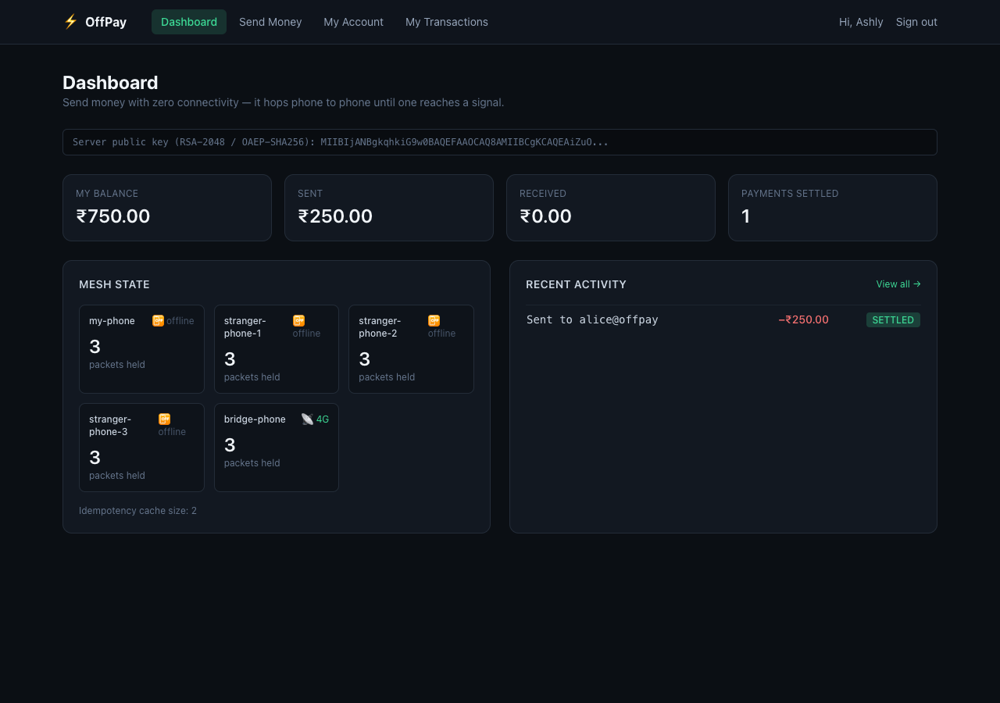
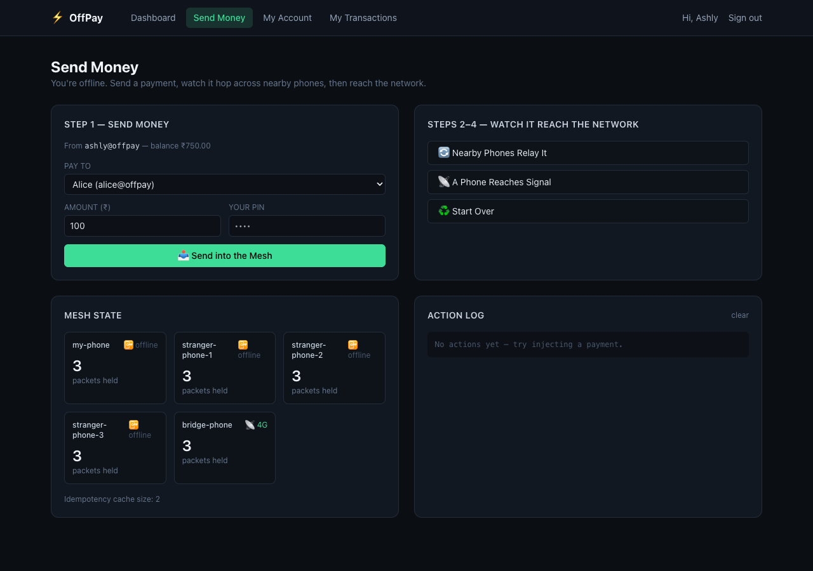
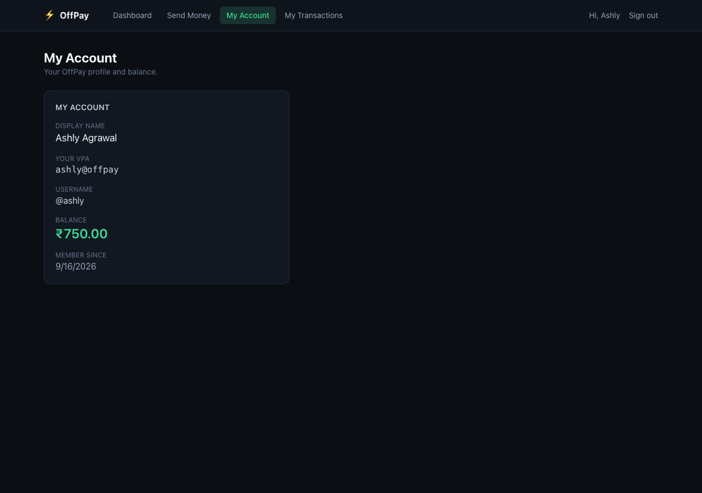
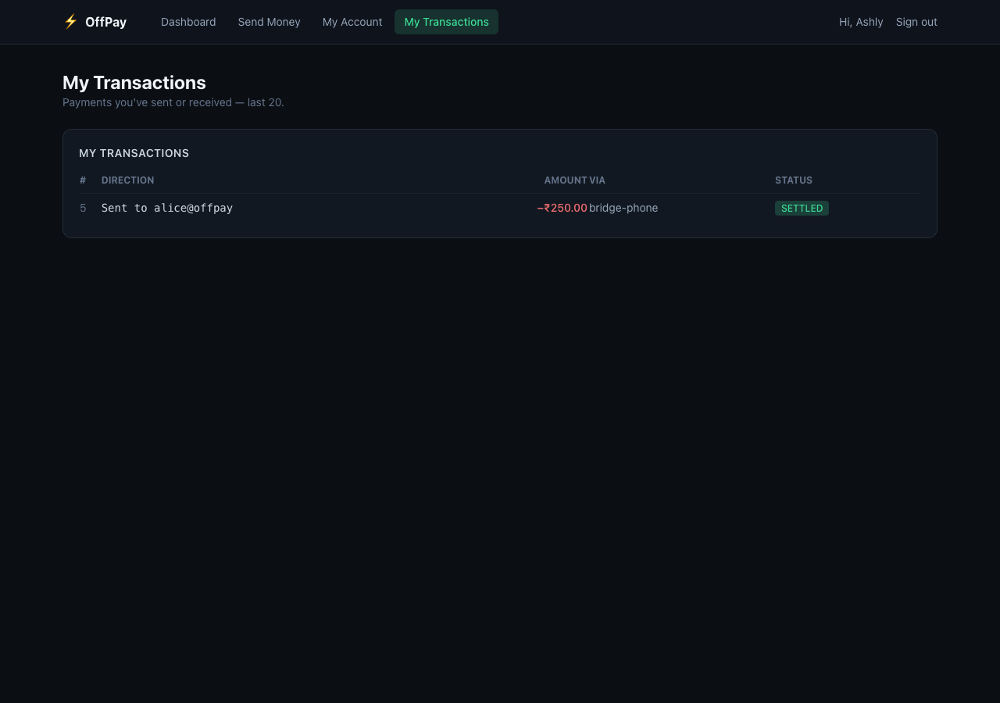

# OffPay

**Offline UPI payments that route themselves through a Bluetooth-style mesh network.**

UPI needs internet. Most of the time that's fine — until it isn't: a basement with no signal, an elevator, a
crowded venue where towers are overloaded, a rural stretch with patchy coverage. OffPay is my answer to that gap:
you're offline, you send a friend ₹500, your phone encrypts the payment and hands it to nearby phones over
Bluetooth, the packet hops device-to-device until *some* phone regains signal and uploads it, and the backend
decrypts, deduplicates, and settles it — exactly once, even if three phones upload the same packet at the same
instant.

This repo is the full-stack implementation: an Express/TypeScript backend that owns the crypto, the mesh
simulation, and the ledger, and a Next.js dashboard to drive the whole flow — sign up, send money, and watch the
payment hop across the network in real time.

## Screenshots

<table>
<tr>
<td><br><sub>Log in</sub></td>
<td><br><sub>Sign up — password + a separate payment PIN</sub></td>
</tr>
<tr>
<td><br><sub>Dashboard — personal stats + live mesh state</sub></td>
<td><br><sub>Send Money — compose a payment, then drive it through the mesh</sub></td>
</tr>
<tr>
<td><br><sub>My Account</sub></td>
<td><br><sub>My Transactions — direction-aware ledger</sub></td>
</tr>
</table>

## The three hard problems

Routing a payment through strangers' phones before it ever reaches a bank creates three problems a normal
online payment never has to solve:

### 1. Untrusted intermediaries

A random stranger's phone is carrying your transaction. It shouldn't be able to read the amount or tamper with it.

**Solution: hybrid encryption (RSA-OAEP + AES-256-GCM).** The sender encrypts the payload with the server's public
key. RSA alone can't encrypt a JSON payload of arbitrary size, so I use the standard hybrid pattern — generate a
fresh AES-256 key per packet, encrypt the payload with AES-GCM, then encrypt just the AES key with RSA-OAEP. AES-GCM
is authenticated encryption: flip a single bit anywhere in the ciphertext and decryption throws instead of silently
producing garbage. Intermediates see opaque bytes and can't forge a valid replacement.

### 2. The duplicate-storm

Multiple bridge phones can end up holding the same packet and walk outside at the same instant, all uploading
within milliseconds of each other. Naively processing all of them double-spends the payment.

**Solution: atomic compare-and-set on the ciphertext hash.** The first thing the backend does with an inbound
packet is hash the ciphertext and try to claim that hash in an idempotency cache. Only the first claimer proceeds
to decrypt and settle; every other delivery of the same packet is dropped as a duplicate before it touches the
ledger. Hashing the *ciphertext* (not the packet ID, which an intermediary could rewrite) means two genuine
deliveries of the same payment are always byte-identical and hash-identical, while two different payments — even
identical amount, same two people, seconds apart — carry different nonces and therefore different hashes.

### 3. Replay attacks

Someone who captured a ciphertext could replay it days later.

**Solution: a signed timestamp plus a nonce inside the encrypted payload.** The backend rejects anything older than
a configurable freshness window, and the nonce means two legitimate payments never collide even if everything else
about them is identical.

## A real multi-user product

This isn't a fixed demo with hardcoded accounts — anyone can sign up and use it:

- **Real signup/login.** Username, display name, password, and a separate 4-6 digit **payment PIN** — the same
  split real UPI apps use: your password gets you into the app, your PIN authorizes a specific payment. New
  accounts get a ₹1000 welcome balance so there's something to send.
- **Every screen is scoped to "you".** No global account list or admin ledger — `/api/me` is your profile,
  `/api/users` is who you can pay (no balances exposed), `/api/transactions` is *your* sent/received history, and
  `/api/payments/send` always sends from your own VPA — it's not a parameter you can spoof.
- **The PIN is checked server-side before anything is encrypted.** Get it wrong and the request is rejected with
  `incorrect_pin` before a packet is even built — not after it's already sitting in the mesh.
- **Optimistic locking on every balance update.** A `version` column plus a conditional `UPDATE` means two
  concurrent transfers touching the same account can't silently corrupt the balance — the loser fails loudly
  instead of getting lost.

## Tech stack

- **Backend:** Node.js, Express, TypeScript, PostgreSQL via Prisma, JWT auth via Passport.js, bcrypt
- **Frontend:** Next.js (App Router), Tailwind CSS, SWR
- **Crypto:** Node's built-in `crypto` — RSA-2048/OAEP + AES-256-GCM hybrid encryption
- **Testing:** Vitest, including a concurrency test that fires the same packet at three simulated bridge nodes
  simultaneously and asserts exactly one settles

## Project layout

```
backend/    Express API — crypto, mesh simulator, settlement, idempotency, auth
frontend/   Next.js dashboard — navbar + 4 routes: Dashboard, Send Money, My Account, My Transactions
docker-compose.yml   Postgres for local dev
```

## Running it

### 1. Start Postgres

```bash
docker compose up -d
```

### 2. Backend

```bash
cd backend
cp .env.example .env
npm install
npm run prisma:migrate
npm run dev
```

The API listens on `http://localhost:8080`.

### 3. Frontend

```bash
cd frontend
cp .env.local.example .env.local
npm install
npm run dev
```

Open `http://localhost:3000` and **sign up** — pick a username, display name, password, and a 4-6 digit PIN.
To actually send money you need a second account to pay: open an incognito window (or a different browser) and
sign up again. Then, from the top navbar:

- **Dashboard** (`/`) — server key, your live stats, mesh state, recent activity
- **Send Money** (`/send`) — pick a contact, enter an amount + your PIN, then **watch it hop: nearby phones relay
  it → a phone reaches signal → settles**
- **My Account** (`/account`) — your profile and balance
- **My Transactions** (`/transactions`) — payments you've sent or received, with direction and running status

### Tests

```bash
cd backend
npm run test
```

Requires the migrated Postgres from step 1. The key test (`bridge ingestion pipeline > settles a single packet
delivered by three bridges exactly once`) fires the same packet at `bridgeIngestionService.ingest()` three times
concurrently and asserts exactly one settlement, proving the idempotency design under real concurrency rather than
just in theory.

## API reference

| Method | Path | Auth | What it does |
|---|---|---|---|
| GET | `/api/server-key` | none | Server's RSA public key |
| POST | `/api/auth/signup` | none | Create an account (username, display name, password, PIN) → JWT |
| POST | `/api/auth/login` | none | Log in → JWT |
| GET | `/api/me` | JWT | Your profile + balance |
| GET | `/api/users` | JWT | Other users you can pay (VPA + display name, no balances) |
| POST | `/api/payments/send` | JWT | Send money — you're always the sender; PIN checked before anything is encrypted |
| GET | `/api/mesh/state` | none | Current state of every virtual device |
| POST | `/api/mesh/gossip` | JWT | Run one round of gossip across the mesh |
| POST | `/api/mesh/flush` | JWT | Bridge phone uploads to backend |
| POST | `/api/mesh/reset` | JWT | Clear mesh + idempotency cache |
| POST | `/api/bridge/ingest` | none | **The production endpoint.** Real bridges POST here — no user login, since a real bridge node would authenticate via mTLS/device certs, not a dashboard user's JWT |
| GET | `/api/transactions` | JWT | Payments you've sent or received, last 20 |

## What's simulated vs. what's production-shaped

This is a portfolio-grade demo, so I named the honest limits rather than overselling it:

| In this build | In a production deployment |
|---|---|
| Software-simulated Bluetooth mesh (`meshSimulatorService`) | Real BLE GATT or Wi-Fi Direct between phones |
| RSA keypair regenerated on every server restart | Private key in an HSM (AWS KMS, HashiCorp Vault); public key cached on devices |
| No auth on `/api/bridge/ingest` | Mutual TLS or signed bridge-node certificates |
| In-memory idempotency cache | Redis with `SET NX EX`, so the guarantee holds across replicas |

The cryptography, the idempotency contract, and the multi-user auth are real engineering, not simplified for the
demo — the infrastructure around them is what would change for production.
